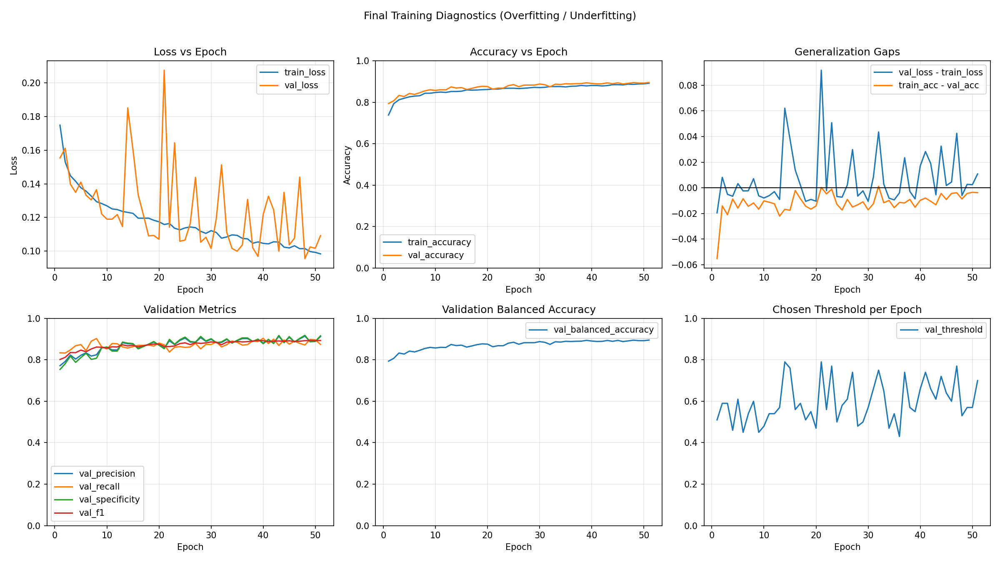
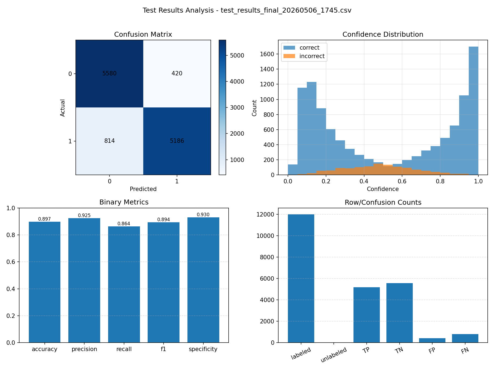

# AI Image Detector

## Abstract

This project implements a custom convolutional neural network for binary image classification: `real` versus `ai`. The final model is a gated multi-evidence CNN that combines normal RGB image evidence with a high-pass residual forensic view. The detector reaches **89.72% accuracy** on the final labeled test set, with high precision and specificity, meaning that AI predictions are usually reliable and real images are relatively well protected from false AI flags.

The project was developed through multiple experimental versions. Earlier iterations exposed problems such as class-label mismatch, over-reliance on simple visual style cues, and unstable bias toward the AI class. The final version keeps the strongest V8 architecture, cleans the training pipeline, adds single-image prediction support, and includes Grad-CAM region explanations for interpretability.

## Final Result

The final model was trained from `src/final/train.py` and evaluated with `src/final/test.py`.

- **Training stopped at:** epoch 51
- **Saved checkpoint threshold:** 0.55
- **Test loss:** 0.2860
- **Accuracy:** 89.72%
- **Precision:** 92.51%
- **Recall:** 86.43%
- **Specificity:** 93.00%
- **F1-score:** 89.37%
- **Labeled samples:** 12,000 / 12,008 total

## Confusion Matrix

| Actual class | Predicted real | Predicted AI |
| ------------ | -------------: | -----------: |
| Real         |           5580 |          420 |
| AI           |            814 |         5186 |

The main remaining error type is **AI -> Real**. In other words, the model misses more AI images than it falsely flags real images as AI. This matches the intended conservative behavior of the selected threshold.

## Metric Plots





## Dataset Layout And Preprocessing

The dataset used for this project is **AI Generated Images vs Real Images** by Tristan Zhang on Kaggle:

https://www.kaggle.com/datasets/tristanzhang32/ai-generated-images-vs-real-images

The dataset is not included directly in this repository because image datasets are large and should be downloaded from the original source. When publishing or reusing this project, follow the dataset terms shown on Kaggle.

After downloading the Kaggle dataset, the project expects this layout:

```text
dataset/
|-- raw/
|   |-- train/
|   |   |-- ai/
|   |   `-- real/
|   |-- test/
|   |   |-- fake/
|   |   `-- real/
|   `-- test_labels.csv
`-- processed/
    |-- train/
    |   |-- ai/
    |   `-- real/
    `-- test/
```

The raw dataset scripts prepare the images before training:

- `dataset/raw/makecsv.py` creates `test_labels.csv` from `dataset/raw/test/real` and `dataset/raw/test/fake`.
- `dataset/raw/resize.py` resizes images and writes them into `dataset/processed`.

The final training set contains a balanced split of real and AI images. The test set contains 12,008 total images, with labels available for 12,000 of them. The processed test images are flattened into names such as `aa00001.jpg` for real images and `ff00001.jpg` for fake/AI images so the evaluation script can match them with the generated CSV labels.

## Final Model Architecture

The final model is implemented in `src/final/model.py`. It is a custom CNN with two evidence branches:

- **RGB branch:** learns normal image/content features from the original RGB image.
- **Residual branch:** receives a high-pass residual version of the image, created by subtracting a blurred version from the original. This emphasizes local artifact evidence such as texture inconsistency, smoothing traces, edge halos, denoising patterns, and compression-like artifacts.

The two evidence streams are combined with a learned residual gate. This gate controls how much influence the forensic residual branch has for each image. This design was introduced because the earlier residual model helped with artifact detection, but could overpower RGB evidence if used too strongly.

The final model also includes auxiliary heads during training:

- fused classifier loss
- RGB branch auxiliary loss
- residual branch auxiliary loss

These auxiliary losses encourage each branch to learn useful evidence while still allowing the fused classifier to make the final decision.

## Training Method

The final training pipeline uses:

- stratified train/validation split
- class-balanced weighted sampling
- focal BCE loss
- capped positive-class weighting
- Adam optimizer with weight decay
- warmup + cosine learning rate schedule
- exponential moving average (EMA) model weights
- early stopping
- validation-selected decision threshold
- checkpoint selection based on:

```text
selection_score = 0.5 * F1 + 0.5 * balanced_accuracy
```

The final run was configured for up to 70 epochs, but early stopping ended training at epoch 51. Training beyond 50 was justified because validation performance continued to improve late in the run, but the final gains were small.

## Augmentation

The final training augmentations were intentionally mild and forensics-aware. The goal was to improve robustness without destroying the subtle artifacts that help distinguish AI-generated images.

The training transform includes:

- resize and crop jitter
- optional JPEG compression jitter
- mild Gaussian blur
- mild sharpening
- small brightness, contrast, and color perturbations
- horizontal flip
- ImageNet-style normalization

The evaluation transform only resizes and normalizes the image, without random augmentation.

## Test-Time Augmentation

The final test pipeline supports TTA. When enabled, the model averages predictions from:

- original image
- horizontally flipped image
- slightly rescaled image

This makes the prediction more stable than relying on a single image view.

## Interpretability

The final version supports Grad-CAM region explanations in both the full test script and the single-image prediction script. These explanations save heatmap overlays showing which general image area most influenced the model's final decision.

For full test runs, the per-image CSV can include:

- `decision_region`
- `region_x`
- `region_y`
- `heatmap_path`

For single-image prediction, the script prints the decision region, strongest region point, and saved Grad-CAM path.

The Grad-CAM heatmap is an approximate visual explanation. It is not a literal list of exact pixels or semantic features checked by the model. It highlights the image region whose learned feature activations were most influential for the predicted class in that forward pass.

## Error Analysis Tools

The final folder also includes two helper scripts for inspecting mistakes after a test run.

### Error Isolation

`src/final/isolate.py` reads a per-image test results CSV and copies misclassified images into separate folders:

- `fp/` for false positives: real images predicted as AI
- `fn/` for false negatives: AI images predicted as real

This makes manual review much faster because the problematic images are separated from the full test set. It was used during development to understand whether mistakes were mostly caused by label issues, ambiguous image types, or repeated visual patterns.

### Feature Sorting

`src/final/featuresort.py` sorts images into visual feature buckets based on simple measurable properties:

- brightness: `dark`, `mid`, `bright`
- contrast: `smooth`, `mixed`, `high_contrast`
- saturation: `muted`, `balanced`, `vivid`

By default, it sorts only misclassified images, but it can also sort all images from a results CSV. This helped identify shortcut-learning patterns, especially cases where the model confused real and AI images with similar tone, contrast, smoothness, or saturation.

## Final Interpretation

The final model reaches **89.72% test accuracy**, which is consistent with the previous V8 result and confirms that the cleaned final implementation preserved the strongest behavior.

Precision is high at **92.51%**, so when the detector predicts `ai`, it is usually correct. Specificity is also high at **93.00%**, meaning real images are relatively well protected from false AI flags.

Recall is lower at **86.43%**, so the remaining weakness is missed AI images. Many of these borderline cases likely overlap visually with edited photography, stylized photography, abstract digital art, or heavily post-processed real images. This suggests that the remaining limitation is partly caused by the binary dataset definition, not only by the architecture.

Overall, the final detector is a strong practical result for the project goal: it has high precision, high specificity, near-90% accuracy, and optional visual explanations for presentation and error analysis.

## Experiment Evolution

The project evolved through several versions:

| Version | Main contribution                                                                                    | Outcome                                                 |
| ------- | ---------------------------------------------------------------------------------------------------- | ------------------------------------------------------- |
| V1      | Initial custom CNN baseline                                                                          | Poor test accuracy and strong AI-class bias             |
| V2      | Modular pipeline, deeper CNN, class weighting, more epochs                                           | Still heavily biased toward AI predictions              |
| V3      | Balanced sampling, capped class weights, validation threshold search                                 | Reduced one-sided bias                                  |
| V4      | New dataset investigation                                                                            | Found important class-label mismatch issue              |
| V5      | Training/test plots, early stopping, false-positive/false-negative analysis, hard mining experiments | Identified shortcut learning around visual style cues   |
| V6      | Residual + SE blocks, focal loss, EMA, cosine LR, forensics-aware augmentation, TTA                  | Improved training strategy and robustness               |
| V7      | Two-branch RGB + residual forensic model                                                             | Residual branch helped, but was too influential         |
| V8      | Gated residual fusion, auxiliary branch losses, balanced checkpoint score                            | Strongest experimental version, about 90% test accuracy |
| Final   | Cleaned V8 implementation, removed unused code, added prediction demo and Grad-CAM explanations      | Final practical result                                  |

## Usage

Run commands from the project root.

### Train Final Model

```bash
python .\src\final\train.py
```

Recommended final training command:

```bash
python .\src\final\train.py --epochs 70 --batch-size 32 --focal-gamma 1.0 --focal-alpha 0.5 --ema-decay 0.995 --min-lr-ratio 0.2 --early-stop-patience 12 --num-workers 8
```

### Evaluate Final Model

```bash
python .\src\final\test.py --tta
```

### Evaluate With Region Explanations

```bash
python .\src\final\test.py --tta --explain-regions --explain-limit 100
```

Use `--explain-limit 0` to generate explanations for every test image:

```bash
python .\src\final\test.py --tta --explain-regions --explain-limit 0
```

Grad-CAM explanation images are saved by default to:

```text
outputs/explanations/final_<timestamp>/
```

### Single-Image Prediction

```bash
python .\src\final\predict.py path\to\image.jpg --tta
```

### Single-Image Prediction With Region Explanation

```bash
python .\src\final\predict.py path\to\image.jpg --tta --explain-regions
```

Single-image Grad-CAM explanations are saved by default to:

```text
outputs/explanations/predict/
```

The heatmap color is red by default. Available colors are:

```text
red, orange, yellow, green, cyan, blue, magenta, white
```

Example:

```bash
python .\src\final\predict.py path\to\image.jpg --tta --explain-regions --heatmap-color cyan
```

### Isolate Test Errors

After running `test.py`, use the generated per-image results CSV to copy false positives and false negatives into review folders:

```bash
python .\src\final\isolate.py --results-path outputs\logs\test_results_final_<timestamp>.csv --source-dir dataset\processed\test --output-dir dataset\processed\isolate
```

### Sort Images By Visual Features

Sort only misclassified images by brightness, contrast, and saturation:

```bash
python .\src\final\featuresort.py --results-path outputs\logs\test_results_final_<timestamp>.csv --source-dir dataset\processed\test --output-dir dataset\processed\featuresort --mode errors
```

Sort every image from the results CSV:

```bash
python .\src\final\featuresort.py --results-path outputs\logs\test_results_final_<timestamp>.csv --source-dir dataset\processed\test --output-dir dataset\processed\featuresort_all --mode all
```

## Project Structure

```text
src/
|-- final/
|   |-- train.py
|   |-- test.py
|   |-- predict.py
|   |-- isolate.py
|   |-- featuresort.py
|   |-- model.py
|   |-- dataset.py
|   `-- utils.py
|-- v1/
|-- v2/
|-- ...
`-- v8/

outputs/
|-- models/
|-- logs/
|-- plots/
`-- explanations/

images/
|-- training_overfit_final.png
`-- test_results_final_analysis.png
```

The older version folders are kept for reproducibility and to show the development path, but the report result uses `src/final`.

## Reproducibility

These steps reproduce the project from a fresh clone. Commands are shown for Windows PowerShell because the project was developed and tested on Windows.

Large generated artifacts are intentionally excluded from GitHub by `.gitignore`: the downloaded dataset, processed images, trained checkpoints, logs, plots, and Grad-CAM explanation dumps. The included source code, README, requirements file, and selected report images in `images/` are enough to reproduce and present the experiment.

### 1. Create Environment

```bash
python -m venv .venv
.\.venv\Scripts\python.exe -m pip install --upgrade pip
```

Install the CUDA PyTorch build used for the final run:

```bash
.\.venv\Scripts\python.exe -m pip install --index-url https://download.pytorch.org/whl/cu118 torch==2.7.1+cu118 torchvision==0.22.1+cu118 torchaudio==2.7.1+cu118
```

Install the remaining dependencies:

```bash
.\.venv\Scripts\python.exe -m pip install -r requirements.txt
```

### 2. Download Dataset

Install and configure the Kaggle API, then download the dataset:

```bash
.\.venv\Scripts\kaggle.exe datasets download -d tristanzhang32/ai-generated-images-vs-real-images -p dataset\raw --unzip
```

If the extracted folders are not already arranged exactly like this, move/rename them into:

```text
dataset/raw/train/real/
dataset/raw/train/ai/
dataset/raw/test/real/
dataset/raw/test/fake/
```

The project uses `ai` for the generated class during training and `fake` for the generated class in the raw test folder, matching the preprocessing scripts.

### 3. Prepare Labels And Processed Images

Generate the test label CSV:

```bash
.\.venv\Scripts\python.exe .\dataset\raw\makecsv.py --test-dir .\dataset\raw\test --output .\dataset\raw\test_labels.csv
```

Resize and flatten the dataset into `dataset/processed`:

```bash
.\.venv\Scripts\python.exe .\dataset\raw\resize.py --input-root .\dataset\raw --output-root .\dataset\processed --size 512 512
```

The model itself uses `256x256` tensors internally during training/evaluation. The preprocessing resize keeps a clean intermediate image size, and the final transforms perform the model-specific crop/resize behavior.

### 4. Train

```bash
.\.venv\Scripts\python.exe .\src\final\train.py --epochs 70 --batch-size 32 --focal-gamma 1.0 --focal-alpha 0.5 --ema-decay 0.995 --min-lr-ratio 0.2 --early-stop-patience 12 --num-workers 8
```

Training writes:

```text
outputs/models/model_final.pth
outputs/models/model_final_threshold.json
outputs/logs/training_log_final_<timestamp>.csv
outputs/plots/training_overfit_final_<timestamp>.png
```

### 5. Test

```bash
.\.venv\Scripts\python.exe .\src\final\test.py --tta
```

Testing writes:

```text
outputs/logs/test_results_final_<timestamp>.csv
outputs/logs/test_summary_final_<timestamp>.csv
```

To regenerate the final metric plots from the CSV outputs:

```bash
.\.venv\Scripts\python.exe .\src\plot.py --input outputs\logs\test_results_final_<timestamp>.csv outputs\logs\test_summary_final_<timestamp>.csv
```

Replace `<timestamp>` with the timestamp from the generated test CSV files.

### 6. Explain Predictions

For Grad-CAM explanations on the test set:

```bash
.\.venv\Scripts\python.exe .\src\final\test.py --tta --explain-regions --explain-limit 100
```

For a single image:

```bash
.\.venv\Scripts\python.exe .\src\final\predict.py path\to\image.jpg --tta --explain-regions
```

## Requirements

- Python 3.13
- PyTorch
- Pillow
- matplotlib

## CUDA Setup

The project was tested with an NVIDIA GeForce GTX 1080 using:

- `torch==2.7.1+cu118`
- `torchvision==0.22.1+cu118`
- `torchaudio==2.7.1+cu118`

Install the tested CUDA build in the project virtual environment:

```bash
python -m pip uninstall -y torch torchvision torchaudio
python -m pip install --index-url https://download.pytorch.org/whl/cu118 torch==2.7.1+cu118 torchvision==0.22.1+cu118 torchaudio==2.7.1+cu118
```

Verify CUDA detection:

```bash
python -c "import torch; print('torch', torch.__version__); print('cuda', torch.version.cuda); print('available', torch.cuda.is_available()); print('device', torch.cuda.get_device_name(0) if torch.cuda.is_available() else 'N/A')"
```
